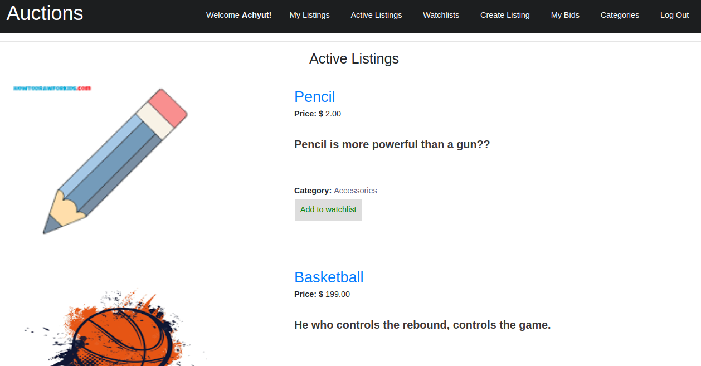

# 🛍️ Commerce

Commerce is a Django web application that allows users to create and bid on auction listings. This project was created as part of CS50's Web Programming with Python and JavaScript course.

## Features
- Registration and login functionality
- Ability to create a new auction listing with a title, description, starting bid, and optional image URL and category
- Three models in addition to the User model: one for auction listings, one for bids, and one for comments made on auction listings
- Create new auction listings with a title, description, starting bid, and optional image URL and category
- Active listings page to view all currently active auction listings, displaying at minimum the title, description, current price, and photo (if one exists)
- Listing page to view all details about a specific listing, including the current price for the listing, with the ability to add to Watchlist if signed in
- Ability to bid on an auction listing, with validation to ensure bid is at least as large as the starting bid and greater than any other bids that have been placed
- Ability for the creator of a listing to "close" the auction, making the highest bidder the winner of the auction and making the listing no longer active
- Ability for signed in users to add comments to the listing page and view all comments made on a specific listing
- Watchlist page for signed in users to view all listings they have added to their watchlist
- Categories page to view all listing categories and active listings within a specific category
- Django Admin Interface for site administrators to view, add, edit, and delete any listings, comments, and bids made on the site.

## Usage
- Clone this repository to your local machine
- Install the required packages using pip install -r requirements.txt
- Set up the database using python manage.py makemigrations and python manage.py migrate
- Create a superuser account to access the Django Admin Interface using python manage.py createsuperuser
- Start the development server using python manage.py runserver and navigate to http://localhost:8000 in your web browser to view the application.

## Screenshots

##Active Listing Page

##Listing Page

📝 Credits

This project was created by Achyut Kayastha (https://github.com/runingcoder).

## 📄 License

This project is licensed under the [MIT License](LICENSE).

